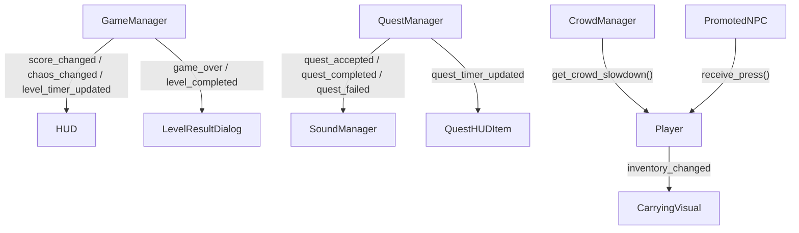

# ĐẶC TẢ CHI TIẾT KỸ THUẬT VÀ KIẾN TRÚC DỰ ÁN "CONCERT MANAGEMENT GAME" (GODOT 4)

---

## 1. TỔNG QUAN DỰ ÁN (PROJECT OVERVIEW)

- **Tên dự án:** Concert (Concert Management 2D Top-down)
- **Engine & Ngôn ngữ:** Godot Engine v4.7 (Forward+ / CanvasItem Rendering), GDScript, Custom GLSL/CanvasItem Shaders.
- **Vật lý Engine:** 2D Godot Physics / Jolt Physics (3D config sẵn sàng).
- **Phong cách nghệ thuật (Art Style):** Pixel Art 2D Top-Down (16x32 sprite scaled, custom pixel font, dynamic 2D lighting & shadows).
- **Thể loại gameplay:** Mô phỏng quản lý sự kiện kết hợp nhập vai hành động top-down (Top-down Action-Management Simulation).

### Bối cảnh & Mục tiêu Gameplay
Người chơi vào vai nhân viên ban tổ chức / an ninh đêm nhạc concert. Trong suốt thời gian diễn ra concert (mặc định 5 phút mỗi màn):
1. **Phục vụ khán giả:** Tiếp nhận yêu cầu từ các NPC khán giả (giao đồ ăn/nước uống, kê ghế ngồi khu vực VIP, bán đồ lưu niệm merchandise, tìm trẻ lạc).
2. **Quản lý trật tự & an ninh:** Dập tắt kịp thời các vụ ẩu đả (Fight Events) bùng phát giữa đám đông khán giả quá khích trước khi chỉ số Hỗn loạn (Chaos Meter) chạm mốc tối đa 100%.
3. **Mục tiêu chiến thắng:** Đạt điểm số cao nhất có thể để chinh phục các mốc sao (1 sao, 2 sao, 3 sao) và mở khóa màn chơi mới.

---

## 2. KÍCH THƯỚC DỰ ÁN VÀ CẤU TRÚC THƯ MỤC (PROJECT STRUCTURE)

```text
concert/
├── project.godot                  # File cấu hình engine, autoloads, input map, rendering
├── 0307-LNTH-TwistyPixel.ttf      # Pixel font tùy chỉnh cho toàn bộ GUI
├── prompt_he_thong_dam_dong.md    # Đặc tả chi tiết cơ chế Crowd System
├── prompt_vat_ly_va_cham.md      # Đặc tả chi tiết cơ chế Physics & Collision
├── PROJECT_SPECIFICATION.md       # (File đặc tả tổng thể hiện tại)
├── Scene/                         # Chứa tất cả màn chơi & UI Scenes (.tscn)
│   ├── main_menu.tscn             # Màn hình chính
│   ├── level_select.tscn          # Màn hình chọn cấp độ (Level Selection)
│   ├── world.tscn                 # Màn hình gameplay chính (Map concert, tilemaps, Y-sort)
│   ├── Player.tscn                # Node nhân vật người chơi (CharacterBody2D + Light + Inventory)
│   ├── npc_interactive.tscn       # Node NPC tương tác được (CharacterBody2D promoted từ MultiMesh)
│   ├── crowd_npc.gdshader         # Custom CanvasItem Shader render đám đông
│   ├── dialogue_box.tscn          # Autoload UI Hộp thoại NPC
│   ├── sound_manager.tscn         # Autoload Âm thanh & Playlist nhạc nền
│   ├── hud.tscn                   # UI Hiển thị điểm, sao, thời gian, chaos, quest list
│   ├── minimap.tscn               # UI Radar chỉ đường real-time
│   ├── fight_event.tscn           # Node sự kiện ẩu đả trong đám đông
│   ├── food_source.tscn           # Quầy lấy đồ ăn
│   ├── chair_source.tscn          # Kho lấy ghế VIP
│   ├── merch_stall.tscn           # Quầy lấy hàng Merchandise
│   ├── lost_child_npc.tscn        # Node NPC trẻ em bị lạc
│   ├── seat_area.tscn             # Khu vực đặt ghế VIP
│   ├── level_start_dialog.tscn    # Dialog xem mục tiêu & bắt đầu level
│   ├── level_result_dialog.tscn   # Dialog tổng kết điểm & sao khi kết thúc
│   ├── pause_menu.tscn            # Menu tạm dừng game & cài đặt âm lượng
│   ├── weather_manager.tscn       # Quản lý thời tiết (Mưa, sương mù, hiệu ứng môi trường)
│   └── mobile_controls.tscn       # Virtual Joystick & Buttons hỗ trợ cảm ứng
└── Scripts/                       # Chứa toàn bộ mã nguồn logic (.gd)
    ├── game_manager.gd            # Autoload: Quản lý level, score, chaos, timer, save/load
    ├── quest_manager.gd           # Autoload: Quản lý khởi tạo, đếm ngược, hủy/hoàn thành Quest
    ├── sound_manager.gd           # Autoload: BGM Playlist MP3/SFX Player
    ├── crowd_manager.gd           # Quản lý 500-1000 NPC MultiMesh, promote/demote, resistance
    ├── player.gd                  # Di chuyển 4 hướng Stardew-style, va chạm, stamina/stress
    ├── npc_interactive.gd         # Logic NPC thật khi promoted, nhận quest, nhận nhường đường
    ├── npc_quest_data.gd          # Resource/Class lưu dữ liệu từng Quest
    ├── player_stats.gd            # Quản lý Stamina & Stress bar
    ├── inventory.gd               # Quản lý túi đồ & vật phẩm người chơi mang theo
    ├── fight_event.gd             # Logic vụ ẩu đả & dập tắt ẩu đả
    ├── stage.gd                   # Quản lý dàn đèn sân khấu & hiệu ứng biểu diễn
    ├── dialogue_box.gd            # Logic gõ chữ Typewriter & lựa chọn dialog
    ├── hud.gd                     # Cập nhật UI thanh thời gian, chaos, điểm số
    ├── minimap.gd                 # Logic quét vị trí radar trên bản đồ
    ├── target_pointer.gd          # Mũi tên chỉ hướng ngoài màn hình dẫn tới quest
    └── weather_manager.gd         # Logic hiệu ứng thời tiết
```

---

## 3. CÁC HỆ THỐNG CỐT LÕI (CORE SYSTEMS & MECHANICS)

### 3.1. Autoload Singletons (Quản lý toàn cục)
Engine định nghĩa 4 Node Autoload khởi tạo ngay từ khi bật ứng dụng:
1. `GameManager` (`*res://Scripts/game_manager.gd`):
   - Quản lý trạng thái màn chơi, mốc thời gian, điểm số (`current_score`), và thanh Chaos (`current_chaos` / `max_chaos`).
   - Cấu hình 3 màn chơi (`LEVEL_CONFIGS`): Mốc sao (1 sao, 2 sao, 3 sao), thời gian giới hạn (300s).
   - Lưu & nạp tiến trình người chơi vào file `user://save_game.cfg` (`save_progress()`, `load_progress()`).
   - Quản lý Custom Cursor chuột (Normal Cursor / Pointing Cursor).
2. `QuestManager` (`*res://Scripts/quest_manager.gd`):
   - Lưu trữ danh sách nhiệm vụ đang kích hoạt (`active_quests`).
   - Cập nhật đếm ngược thời gian nhiệm vụ mỗi frame; tự động gọi `fail_quest()` khi hết giờ.
   - Tự động phát sinh nhiệm vụ đột xuất Bán Merchandise (Pop-up Merch Quest) sau mỗi 85 giây (`auto_merch_popup_interval`).
   - Tạo hiệu ứng hạt pháo hoa (`CPUParticles2D`) & rung camera khi hoàn thành quest.
3. `SoundManager` (`*res://Scene/sound_manager.tscn`):
   - Tự động quét thư mục `res://Music/` và `res://sound/` nạp file MP3/WAV/OGG vào playlist nhạc nền.
   - Quản lý chế độ Shuffle / Loop playlist, chuyển bài tự động khi kết thúc track.
   - Phát âm thanh SFX sự kiện: Nhận quest, hoàn thành quest, thất bại, lấy đồ ăn, lấy ghế, bán merch.
4. `DialogueBox` (`*res://Scene/dialogue_box.tscn`):
   - Hộp thoại giao tiếp với NPC. Hỗ trợ hiệu ứng gõ chữ (typewriter), ảnh đại diện (avatar), nút Đồng ý (Accept) / Từ chối (Decline).

---

### 3.2. Hệ Thống Đám Đông NPC & Tối Ưu Render (CrowdManager)

#### a. Thử thách hiệu năng & Giải pháp MultiMeshInstance2D
Một đêm concert yêu cầu 500 – 1000 NPC xuất hiện đồng thời. Nếu tạo mỗi NPC là 1 Node `CharacterBody2D` riêng lẻ, game sẽ sụt giảm FPS nghiêm trọng do overhead của Node tree và hàng nghìn draw calls.

**Giải pháp:** `CrowdManager` sử dụng `MultiMeshInstance2D` để render toàn bộ 500+ NPC khán giả bằng **1 Draw Call duy nhất per layer**. Dữ liệu NPC được quản lý dưới dạng Array-of-Struct trong GDScript qua các `PackedArray`:
- `positions: PackedVector2Array`
- `velocities: PackedVector2Array`
- `outfit_ids: PackedInt32Array`
- `has_quest_flags: PackedByteArray`
- `is_promoted: PackedByteArray`
- `time_offsets: PackedFloat32Array`

#### b. Xử lý Y-Sorting giữa MultiMesh và Player Node (Dual MultiMesh Buffer)
Vì 1 `MultiMeshInstance2D` là 1 Node CanvasItem đơn lẻ trong cây node Godot, nó không thể tự đan xen Y-Sort từng instance bên trong với một Node riêng như `Player` (`CharacterBody2D`).

**Kỹ thuật độc đáo:** `CrowdManager` duy trì **2 Node MultiMeshInstance2D**:
- `mm_back` (nằm phía dưới Player trong cây node): Vẽ tất cả NPC có vị trí `Y <= Player.position.y`.
- `mm_front` (nằm phía trên Player trong cây node): Vẽ tất cả NPC có vị trí `Y > Player.position.y`.
Mỗi frame trong `_process()`, `CrowdManager` tự động phân loại lại instance index vào 1 trong 2 buffer này dựa theo tọa độ Y so với Player, giải quyết hoàn hảo lỗi đè lớp mà vẫn giữ nguyên tối ưu 2 draw calls!

#### c. Shader Tùy Chỉnh (`crowd_npc.gdshader`)
Shader CanvasItem nhận dữ liệu từ `INSTANCE_CUSTOM` truyền vào để xử lý:
- Tọa độ UV offset theo hướng di chuyển / animation frame.
- Nhịp bước đi lệch pha (`time_offset`) giúp đám đông trông tự nhiên, không bị giật lặp đồng bộ.
- Logic UV offset phân tách Outfit ID, sẵn sàng nạp Texture Atlas nhiều bộ trang phục khác nhau mà không cần viết lại shader core.

#### d. Cơ chế Promote / Demote & Object Pooling (`pool_size = 30`)
- **Promote:** Khi Player di chuyển vào bán kính `promote_radius` (200px) của một NPC có nhiệm vụ (`has_quest = true`) và chưa promoted:
  1. `CrowdManager` lấy 1 Node `npc_interactive.tscn` từ Object Pool đã pre-instantiate (30 nodes).
  2. Đặt Node tại vị trí NPC, nạp trang phục/animation tương ứng.
  3. Ẩn instance tương ứng trong MultiMesh (bằng cách đặt transform zero/out-of-bounds).
  4. Đánh dấu `is_promoted[i] = 1`.
- **Demote:** Khi Player ra xa ngoài bán kính `demote_radius` (250px):
  1. Nếu NPC **chưa từng được chấp nhận quest** -> Thu hồi Node về Pool, hiện lại instance trong MultiMesh.
  2. Nếu NPC **đã tương tác / đang thực hiện quest** -> Giữ nguyên Node thật để bảo toàn trạng thái công việc.

---

### 3.3. Cơ Chế Vật Lý Va Chạm & Kháng Lực Đám Đông (Physics & Crowd Resistance)

> ⚠️ **Triết lý thiết kế:** Loại bỏ hoàn toàn lực đẩy "push" phi vật lý (đẩy NPC bay ra xa như bóng bi-a). Thay vào đó áp dụng cơ chế **"Resistance / Yield" (Kháng lực & Nhường đường)** — tạo cảm giác giống chen qua đám đông thực tế.

#### a. Lớp Va Chạm Player ↔ Promoted NPC (Physics Thật)
- Player và Promoted NPC đều sở hữu `CollisionShape2D`.
- Va chạm cứng được chặn tuyệt đối bởi `move_and_slide()` của Godot (Collision Layer 1: `player`, Layer 2: `npc`).
- **Logic nhường nhẹ (`npc_interactive.gd`):** Promoted NPC không tự gọi `move_and_slide()`. Khi Player ép vào, Player gọi `receive_press(direction)` trên NPC. NPC lệch vị trí nhẹ (`yield_max_offset = 6.0px`) với tốc độ rất chậm (`yield_speed = 40.0px/s`), sau đó tự hồi về `base_position`.
- **Player tự giảm tốc (`player.gd`):** Khi phát hiện va chạm slide collision với NPC, Player tự giảm tốc độ của chính mình ở frame kế tiếp (`contact_slowdown_factor = 0.88`).

#### b. Lớp Va Chạm Player ↔ Crowd NPC Nền (Resistance Calculation)
- NPC nền trong MultiMesh không có node physics.
- Mỗi frame trong `CrowdManager._apply_separations()`, hệ thống quét các NPC nền nằm trong bán kính `crowd_resistance_radius` (42px) quanh Player:
  1. Đếm tổng số NPC nền xung quanh (`_last_crowd_density`).
  2. Dịch nhẹ NPC nền ra ngoài theo hướng vector chênh lệch (`npc_yield_strength = 75.0px/s`).
  3. Cung cấp hàm `get_crowd_slowdown()` cho `player.gd`.
- **Cơ chế Player Slowdown:** `player.gd` lấy hệ số `crowd_mult = crowd_manager.get_crowd_slowdown()`. Đám đông càng dày, `crowd_mult` càng giảm (giới hạn tối thiểu `min_speed_multiplier = 0.85`), làm tốc độ di chuyển của Player tự chậm lại như đang chen lội qua biển người.

---

### 3.4. Hệ Thống Nhiệm Vụ (Quest System) & Quản Lý Vật Phẩm

Dữ liệu nhiệm vụ được đóng gói trong class `NPCQuestData` (`Scripts/npc_quest_data.gd`).

#### Các loại Quest (`QuestType`):
1. **FOOD_DELIVERY (Giao đồ ăn/nước uống):**
   - NPC yêu cầu đồ ăn -> Player di chuyển tới `food_source.tscn` -> Bấm nút tương tác lấy đồ ăn -> Quay lại giao cho NPC.
2. **CHAIR_DELIVERY (Kê ghế VIP):**
   - NPC VIP yêu cầu ghế -> Player tới kho ghế `chair_source.tscn` lấy ghế -> Mang tới đặt tại khu vực ghế `seat_area.tscn` tương ứng.
3. **LOST_CHILD (Tìm trẻ lạc):**
   - Phụ huynh báo mất con -> Player di chuyển khắp concert tìm NPC bé gái `lost_child_npc.tscn` -> Dẫn bé gái quay về với phụ huynh.
4. **MERCH_SELLING (Bán đồ lưu niệm):**
   - Player tới quầy Merch `merch_stall.tscn` nhận lô hàng -> Tìm các NPC có biểu tượng mua sắm (🛍️) để bán hàng.
5. **Pop-up Merch Quest (Nhiệm vụ đột xuất):**
   - Tự động kích hoạt toàn cục mỗi 85 giây, yêu cầu Player bán đủ số lượng mặt hàng trong thời gian ngắn để nhận phần thưởng lớn.

#### Player Inventory & Carrying Visuals:
- `PlayerInventory` quản lý danh sách ô chứa vật phẩm. Mỗi khi nhận quest hoặc lấy hàng từ quầy, item được gán vào slot.
- `update_carrying_visuals()` trong `player.gd` tự động cập nhật Sprite hiển thị đồ vật đang mang vác trên đầu nhân vật (`CarryingVisual`).
- `PlayerStats` theo dõi 2 chỉ số quan trọng:
  - **Stamina (Thể lực):** Tiêu hao khi giữ phím Chạy (`run`), tự phục hồi khi đi bộ hoặc đứng yên.
  - **Stress (Căng thẳng):** Tăng khi để quest bị trễ giờ/thất bại; giảm khi hoàn thành quest thành công.

---

### 3.5. Hệ Thống An Ninh, Ẩu Đả & Sân Khấu (Events & Hype)

#### a. Sự Kiện Ẩu Đả (Fight Events - `fight_event.gd`)
- Khi concert diễn ra, `fight_spawner.gd` ngẫu nhiên kích hoạt các cuộc va chạm / ẩu đả giữa khán giả tại các vùng trong sân vận động.
- Một vụ ẩu đả hiển thị hiệu ứng khói bụi, icon cảnh báo (💥) và âm thanh hỗn loạn.
- Nếu không được xử lý, vụ ẩu đả liên tục cộng điểm Hỗn loạn (`GameManager.add_chaos()`).
- Player phải chạy lại gần và giữ nút tương tác để giải tán đám đông quá khích, dập tắt vụ ẩu đả, nhận điểm thưởng và hạ Chaos.

#### b. Hệ Thống Sân Khấu & Đèn Bè (`stage.gd`)
- Điều khiển nhịp điệu đêm diễn: Ban nhạc biểu diễn, dải đèn Spotlight xoay chiếu khán giả, hiệu ứng đèn Neon đổi màu theo giai điệu nhạc nền.
- Đồng bộ hiệu ứng hình ảnh với nhịp điệu BGM phát từ `SoundManager`.

---

### 3.6. Giao Diện Người Dùng (UI/UX) & Điều Khiển

#### a. HUD Màn Chơi (`hud.gd`)
- **Thanh Thời Gian (Timer Bar):** Đếm ngược thời gian còn lại của màn chơi.
- **Thanh Hỗn Loạn (Chaos Bar):** Hiển thị mức độ hỗn loạn hiện tại (chuyển màu từ Xanh -> Vàng -> Đỏ khi chạm ngưỡng cao).
- **Mốc Sao (Star Thresholds):** Hiển thị 3 mốc điểm tương ứng với 1 sao, 2 sao, 3 sao.
- **Danh sách Quest Active (`quest_hud_item.gd`):** Mỗi quest có thanh đếm ngược riêng và icon vật phẩm trực quan.

#### b. Radar Minimap & Target Pointer
- `minimap.gd`: Hiển thị bản đồ thu nhỏ góc màn hình, quét tọa độ real-time của Player (chấm xanh), NPC Quest (chấm vàng), Quầy hàng (chấm xanh dương), Vụ ẩu đả (chấm đỏ).
- `target_pointer.gd`: Mũi tên định hướng xoay quanh Player, chỉ hướng chính xác tới mục tiêu quest gần nhất khi mục tiêu nằm ngoài màn hình.

#### c. Hệ Thống Menu & Dialog
- `main_menu.gd`: Màn hình chờ chính với hiệu ứng nút bấm, chuyển scene mượt mà.
- `level_select.gd`: Chọn cấp độ, hiển thị số sao đã đạt được & lưu trong file save.
- `level_start_dialog.gd`: Popup hiển thị mục tiêu nhiệm vụ trước khi nhấn PLAY bắt đầu đếm giờ.
- `level_result_dialog.gd`: Thống kê kết quả khi hết giờ hoặc Game Over.
- `pause_menu.gd`: Menu tạm dừng, hỗ trợ thanh trượt điều chỉnh âm lượng BGM / SFX real-time.

---

## 4. LUỒNG DỮ LIỆU & KIẾN TRÚC MÃ NGUỒN (CODE ARCHITECTURE)

### 4.1. Quy Chuẩn Đóng Gói Signal (Signal-Driven Architecture)
Dự án sử dụng triết lý **Event-Driven / Signal-Driven** hoàn toàn để giảm thiểu độ phụ thuộc chặt (tight coupling) giữa các hệ thống:



### 4.2. Nguyên Tắc Lập Trình Thâm Nhập An Toàn (Defensive Coding)
1. **Kiểm tra Null Safe:** Mọi lệnh gọi node liên thông đều sử dụng `get_node_or_null()`, `is_instance_valid()`, hoặc `has_method()` trước khi truy cập phương thức/thuộc tính.
2. **Process Mode Isolation:** Các Node Quản lý (`GameManager`, `SoundManager`) đặt `process_mode = Node.PROCESS_MODE_ALWAYS` để tiếp tục xử lý âm thanh/lưu game ngay cả khi `get_tree().paused = true`.
3. **Guard Clauses:** Tất cả các hàm tính toán frame (`_process`, `_physics_process`) đều kiểm tra trạng thái màn chơi (`is_gameplay_started`, `is_level_active`) ở dòng đầu tiên để tránh tính toán thừa.

---

## 5. HƯỚNG DẪN TEST & DEBUG HỆ THỐNG

### 5.1. Debug Đám Đông & Hiệu Năng (Crowd System Benchmark)
- Trong Inspector của Node `CrowdManager` (trong `world.tscn`):
  - Đổi `npc_count` lên `800` hoặc `1000` để kiểm tra FPS và hiệu năng MultiMesh.
  - Thay đổi `quest_probability` (mặc định `0.04` = 4%) để tăng/giảm mật độ NPC có nhiệm vụ.
  - Chỉnh `promote_radius` và `demote_radius` để quan sát quá trình thăng/hạ cấp Node NPC trong Editor Viewport.

### 5.2. Debug Vật Lý Kháng Lực (Physics Resistance Tuning)
- Trong Inspector của Node `Player` và `CrowdManager`:
  - Adjust `crowd_resistance_radius`: Bán kính cảm nhận đám đông quanh Player.
  - Adjust `contact_slowdown_factor` (trong `player.gd`): Tỉ lệ giảm tốc khi va vào Promoted NPC.
  - Adjust `min_speed_multiplier`: Tốc độ tối thiểu của Player khi đi vào tâm đám đông dày đặc nhất.

### 5.3. Debug Quest & Am Thanh (Sound & Quest Debug)
- Bấm phím tạm dừng để mở `PauseMenu`, kéo các thanh trượt BGM / SFX Volume để kiểm tra cập nhật âm lượng `AudioServer` và `SoundManager`.
- Quan sát Log Console với các tiền tố chuẩn hóa:
  - `[GameManager]` : Log sự kiện màn chơi, điểm số, save/load.
  - `[QuestManager]` : Log nhận, hoàn thành, thất bại quest.
  - `[SoundManager]` : Log nạp file mp3, phát track bgm, trigger sfx.

---

## 6. TỔNG KẾT TIÊU CHÍ HOÀN THÀNH (ACCEPTANCE CRITERIA)

| Tiêu chí | Trạng thái | Ghi chú kỹ thuật |
|---|---|---|
| Render 500+ NPC mượt mà | **HOÀN THÀNH** | Dùng Dual `MultiMeshInstance2D` (`mm_back`/`mm_front`), 2 draw calls. |
| Y-Sort mượt giữa Player & MultiMesh | **HOÀN THÀNH** | Phân loại buffer theo tọa độ Y so với Player mỗi frame. |
| Shader Animation & Atlas | **HOÀN THÀNH** | Custom CanvasItem shader đọc `INSTANCE_CUSTOM`. |
| Promote / Demote NPC | **HOÀN THÀNH** | Object pool 30 node `npc_interactive.tscn`, khoảng cách promote 200px / demote 250px. |
| Vật lý Kháng lực không đẩy bay | **HOÀN THÀNH** | Cơ chế Yielding + Slowdown mật độ đám đông thực tế. |
| Đa dạng Quest & Vật phẩm | **HOÀN THÀNH** | Giao đồ ăn, Kê ghế VIP, Trẻ lạc, Bán Merch, Merch Pop-up. |
| Sự kiện An ninh & Hỗn loạn | **HOÀN THÀNH** | Fight Events bùng phát, dập tắt ẩu đả, thanh Chaos 0-100%. |
| Âm thanh & Music Playlist | **HOÀN THÀNH** | Tự động quét BGM MP3 & SFX, hỗ trợ Shuffle/Loop, Pause menu volume. |
| UI/UX Hoàn chỉnh | **HOÀN THÀNH** | Main menu, Level select, Level start/result, Pause menu, Minimap radar, Target pointer. |

---
*Bản đặc tả tài liệu được tự động cập nhật và đồng bộ theo cấu trúc mã nguồn Godot 4 mới nhất của dự án.*
